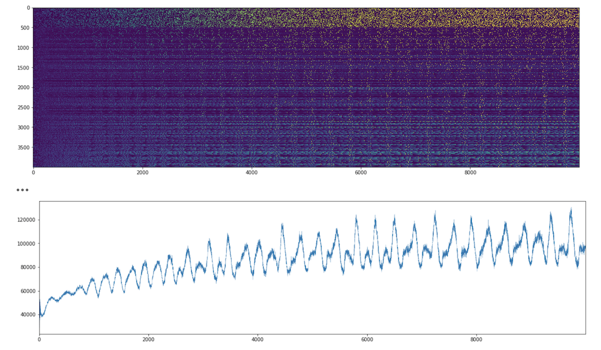

This repository contains experiments in digital spiking neural networks.

The work is inspired by the [Simple Model of Spiking Neurons](https://www.izhikevich.org/publications/spikes.htm) by Eugene M. Izhikevich. However, we are attempting to build something that has a greater hardware-affinity while retaining the important properties of the spiking networks.

# Goals

First, we want to build a spiking neural network that can play a simple game of tracking the dot with an eye:

Then, we want to make a network that can adapt (without expensive recomputation) even if the rules of the game change slightly.

## V1-V5

Versions from one to 5 attempt to come up with a model that is computationally simple (e.g. doesn't have multiplication or division) but can still exhibit complex behavior.

## V6

In V6 we rewrote the core code in golang to speed up the computation and run larger networks. We are still manually tunning the parameters and the network model here.

